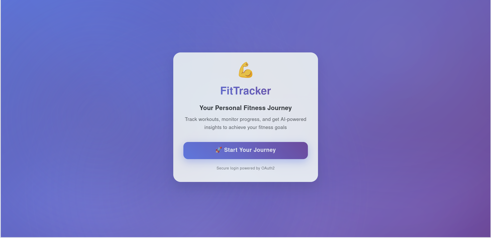
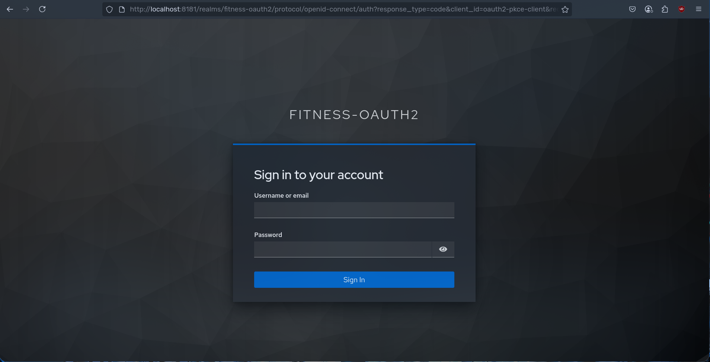
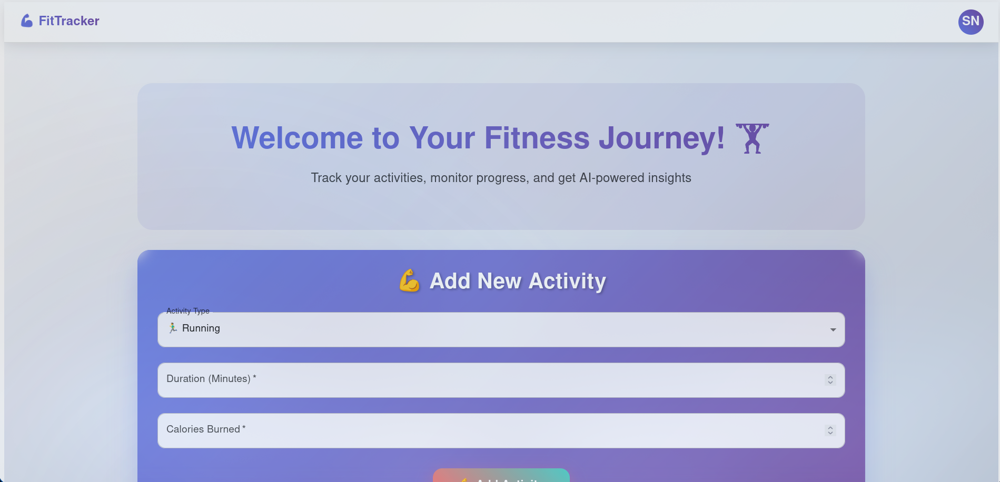
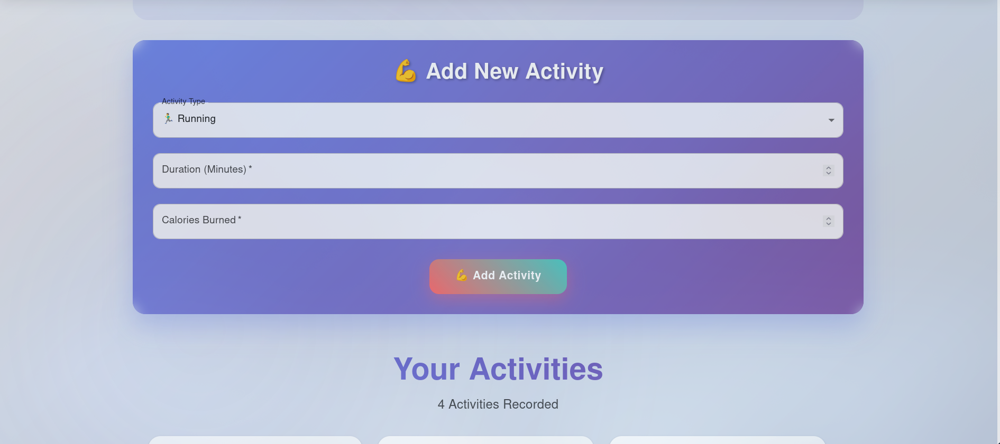
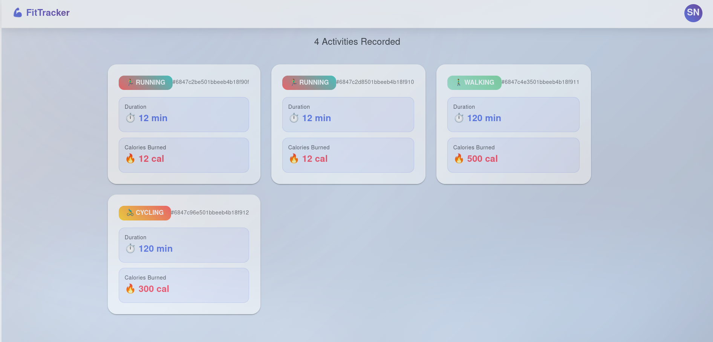
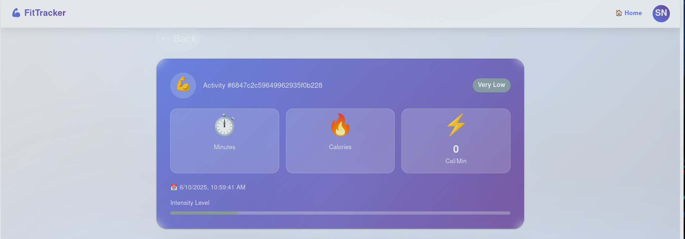
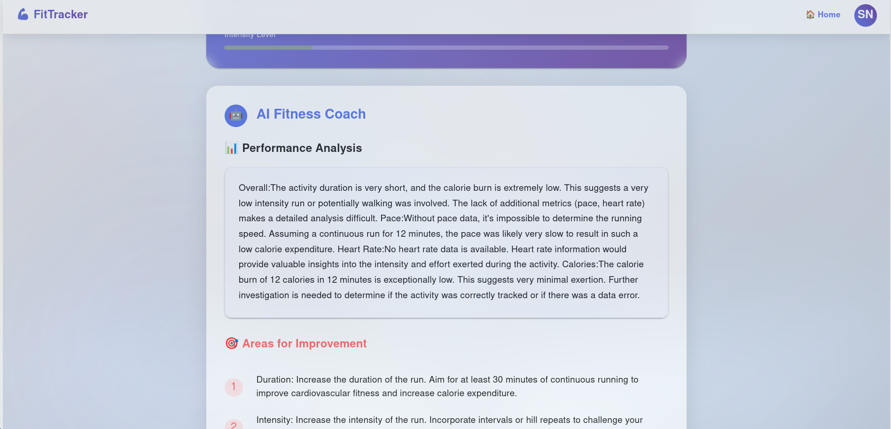
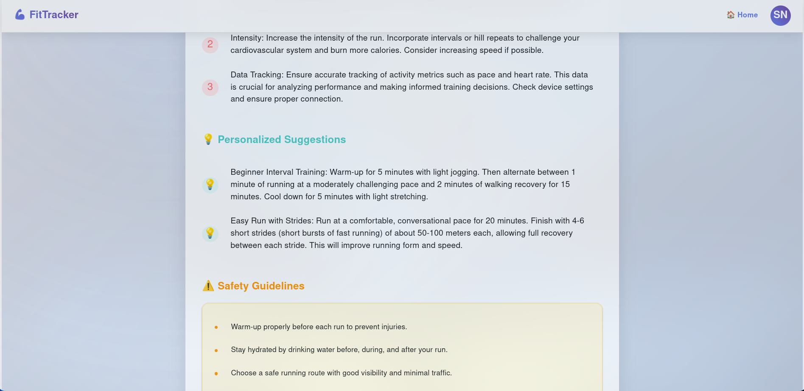

# FitTracker - A Microservices-based Fitness Application

FitTracker is a comprehensive fitness tracking application built using a microservices architecture with Spring Boot. It enables users to log fitness activities, receive AI-powered recommendations, and manage their profiles securely.

## Features

- Track various fitness activities (e.g., running, cycling, yoga) with detailed metrics
    
- Receive personalized AI-powered fitness recommendations
    
- Secure user authentication and profile management
    
- Scalable microservices architecture
    
- Service discovery and load balancing with Netflix Eureka
    
- Event-driven communication via RabbitMQ
    

## Architecture

FitTracker employs a microservices architecture where each service handles a specific domain:

- **User Service**: Manages user registration, authentication, and profiles.
    
- **Activity Service**: Logs and retrieves fitness activities.
    
- **AI Service**: Analyzes activities and provides AI recommendations.
    
- **Gateway Service**: Routes requests and enforces security.
    
- **Eureka Server**: Enables service discovery and registration.
    

Services communicate via REST APIs and RabbitMQ for asynchronous events.

## Services Overview

### User Service

- **Purpose**: Handles user accounts and authentication
    
- **Tech**: Spring Boot 3.5.0, Java 21, MySQL (JPA/Hibernate), Keycloak (OAuth2), Eureka
    
- **Features**: User registration, profile retrieval, validation
    

### Activity Service

- **Purpose**: Tracks fitness activities
    
- **Tech**: Spring Boot 3.5.0, Java 21, MongoDB, RabbitMQ, Eureka, WebClient
    
- **Features**: Activity logging, user validation, event publishing
    

### AI Service

- **Purpose**: Generates AI-powered recommendations
    
- **Tech**: Spring Boot 3.5.0, Java 21, MongoDB, RabbitMQ, Google Gemini API, Eureka, WebFlux
    
- **Features**: Activity analysis, recommendation storage
    

### Gateway Service

- **Purpose**: API entry point with routing and security
    
- **Tech**: Spring Boot 3.5.0, Spring Cloud Gateway, Eureka, OAuth2 (Keycloak), WebClient
    
- **Features**: Request routing, authentication, user synchronization
    

### Eureka Server

- **Purpose**: Service registry for discovery
    
- **Tech**: Spring Boot 3.5.0, Spring Cloud 2025.0.0, Java 21
    
- **Features**: Centralized service discovery and load balancing
    

## Setup and Installation

### Prerequisites

- Java 21
    
- Maven
    
- Docker and Docker Compose
    
- MySQL and MongoDB (or Docker containers)
    
- RabbitMQ (or Docker container)
    
- Keycloak (or Docker container)
    

### Steps

1. **Clone the Repository**
    
    ```bash
    git clone https://github.com/yourusername/fittracker.git
    cd fittracker
    ```
    
2. **Build the Services**
    
    ```bash
    mvn clean install
    ```
    
3. **Run the Services**Use Docker Compose for simplicity:
    
    ```bash
    docker-compose up
    ```
    
    This starts all services, databases, and message brokers.
    
4. **Access the Application**
    
    - Gateway: http://localhost:8080
        
    - Eureka Dashboard: http://localhost:8761
        

## Usage

Access the application via the gateway (http://localhost:8080). Assuming a frontend exists (e.g., at http://localhost:5173), you can:

- Register or log in
    
- Log fitness activities
    
- View activity history and AI recommendations
    
- Update your profile
    

## Screenshots

Below are eight screenshots showcasing the FitTracker UI:

1. **Intro Page**  
    
    
2. **Login Page**  
    
    
3. **User DashBoard 1**  
    
    
4. **User DashBoard 2**  
    
    
5. **User DashBoard 3**  
    
    
6. **Activity Details 1**  
    
    
7. **Activity Details 2**  
    
    
8. **Activity Details 3**  
    
    

_Note: Replace_ path/to/ _with actual screenshot paths._

## Contributing

Contributions are welcome! Please fork the repository and submit a pull request with your changes.

## License

This project is licensed under the MIT License - see the LICENSE file for details.
